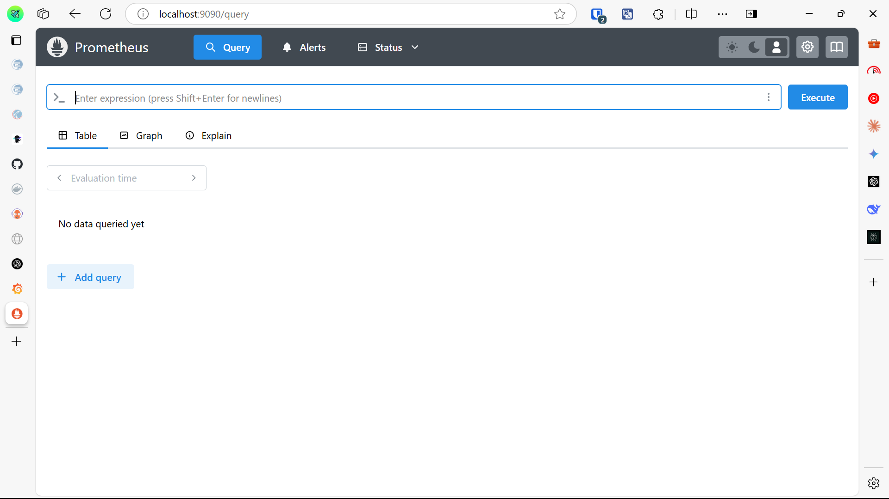
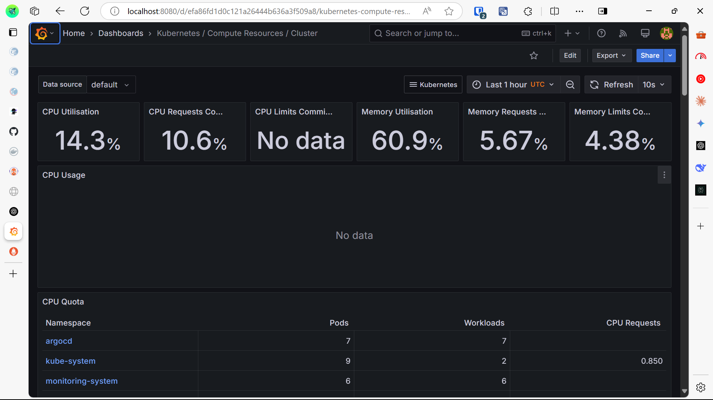
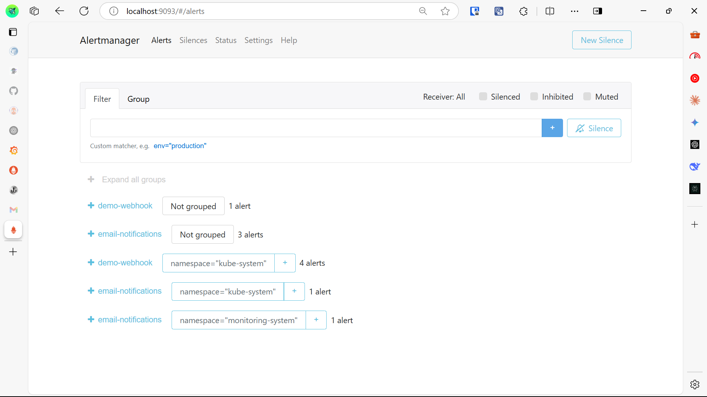
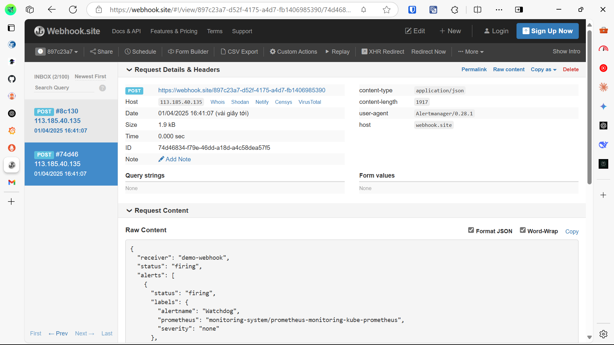
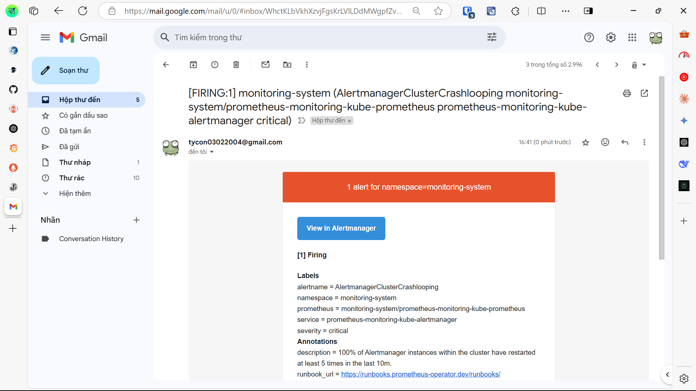

Name: Trần Vỹ Anh (StudentID: 22024508)

## Overview
This project demonstrate how to deploy the Spring Boot application to Kubernetes and implement comprehensive monitoring with Prometheus and Grafana.

## Key Features
- Prometheus for metrics collection
- Grafana for visualization
- Alert Manager for notifications
- Node Exporter for infrastructure metrics

## Screenshot
### 1. Prometheus (Port 9090)

### 2. Grafana (Port 8080)

### 3. Alertmanager (Port 9093)

#### Alert sent to Webhook

#### Alert sent to Email
