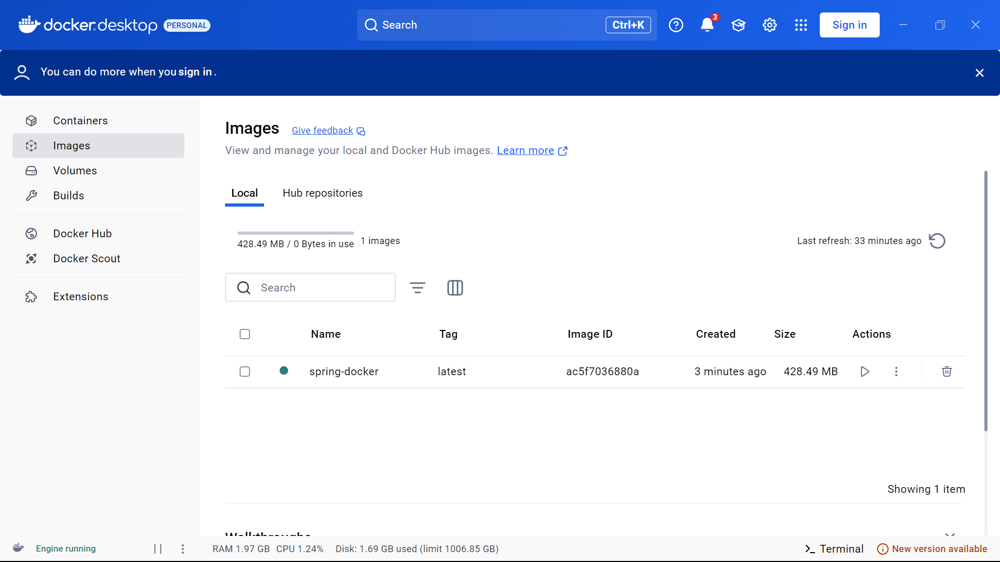
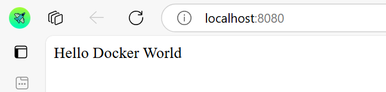
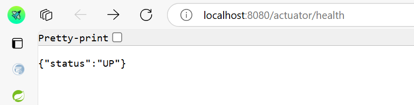

# Docker Deployment

Name: Trần Vỹ Anh
StudentID: 22024508

## Overview
This section describes how to containerize the application using Docker and run it in a containerized environment.

## Key Features
- Dockerfile-based containerization
- Running the application in a Docker container
- Port mapping for external access
- Persistent storage and environment variables configuration

## Installation Guide
1. **Build the Docker image:**
    ```sh
    docker build -t myapp:latest .
    ```

2. **Run the application in a container:**
    ```sh
    docker run -d -p 8080:8080 --name myapp_container myapp:latest
    ```

3. **Check running containers:**
    ```sh
    docker ps
    ```

4. **Stop and remove the container:**
    ```sh
    docker stop myapp_container
    docker rm myapp_container
    ```

## Screenshot


