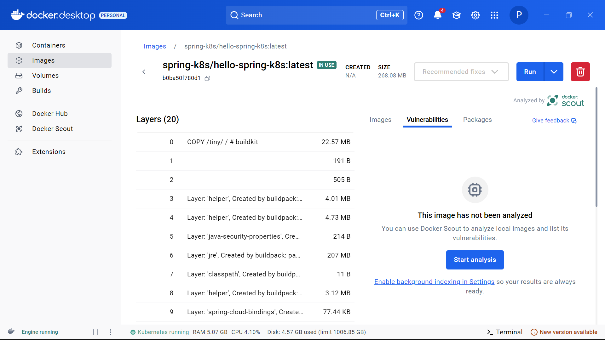
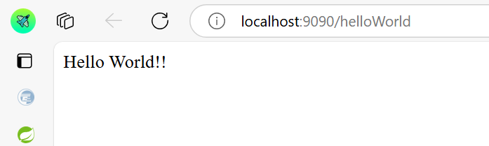
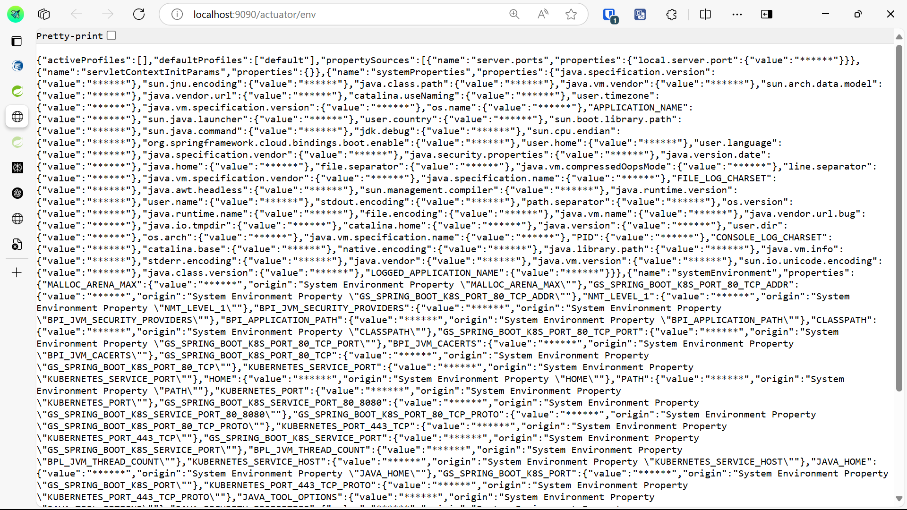

# Kubernetes Deployment

Name: Trần Vỹ Anh
StudentID: 22024508

## Overview
This section describes how to deploy the application to a Kubernetes cluster.

## Key Features
- Kubernetes Deployment and Service configuration
- Pod scaling and self-healing capabilities
- Exposing services via NodePort
- Using ConfigMaps and Secrets for configuration management

## Installation Guide
1. **Apply the deployment configuration:**
    ```sh
    kubectl apply -f deployment.yaml
    ```

2. **Apply the service configuration:**
    ```sh
    kubectl apply -f service.yaml
    ```

3. **Check the deployed resources:**
    ```sh
    kubectl get pods
    kubectl get services
    ```

4. **Access the application:**
    If using a **NodePort** service, find the mapped port:
    ```sh
    kubectl get svc
    ```
    Then access:
    ```
    http://<NODE_IP>:<NODE_PORT>/api/test
    ```

5. **Delete resources when done:**
    ```sh
    kubectl delete -f deployment.yaml
    kubectl delete -f service.yaml

## Screenshot


